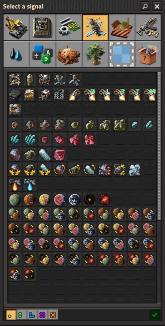

# Space Connection Signals

Adds individual signal icons for space routes between planets and space
locations in Space Age.

These signals can be used in: - Circuit networks - Display panels -
Logistic labelling - Blueprints - Any system that supports virtual
signals

Each signal visually represents a route from one body to another using
layered planet icons over the Space Age route background.

---

## Why This Mod Exists

This mod was originally created for space platform naming and logistic
group labelling.

The vanilla game only provides single-planet signal icons. When building
space platforms, it can be useful to display both the **origin** and
**destination** of a route on a single screen, especially on
dashboard-style display panels while a platform is in transit.

By generating combined route signals (Origin → Destination), this mod
allows you to effectively merge "heading from" and "heading to" into a
single, clean signal icon.

It's admittedly a bit niche, but it looks great on platform
dashboards.

---

## Features

-   Automatically generates signals for all planets and space locations
-   Fully compatible with modded planets and space-locations
-   Galaxy-order sorting for clean signal grouping
-   Optional startup settings to limit signal generation
-   No runtime scripts
-   No UPS impact

---

## Startup Settings

### Only generate direct starmap connections

Generates signals only for planet/location pairs that have a direct
`space-connection` defined on the starmap.

Useful for large mod packs that introduce many indirect bodies.

### Generate one signal per pair (galaxy order)

Generates only one directional signal per pair of bodies.

This reduces total signal count by roughly half.

Both settings can be enabled independently or together.

---

## Compatibility

-   Requires **Factorio 2.0**
-   Requires **Space Age**
-   Compatible with modded planets and space-locations
-   Automatically adapts to added `space-connection` prototypes

---

#  Current Version

[v1.0.0 Initial Stable Release](https://github.com/lyttelgeek/SpaceConnectionSignals/releases/tag/1.0.0-Initial_Release)

---

